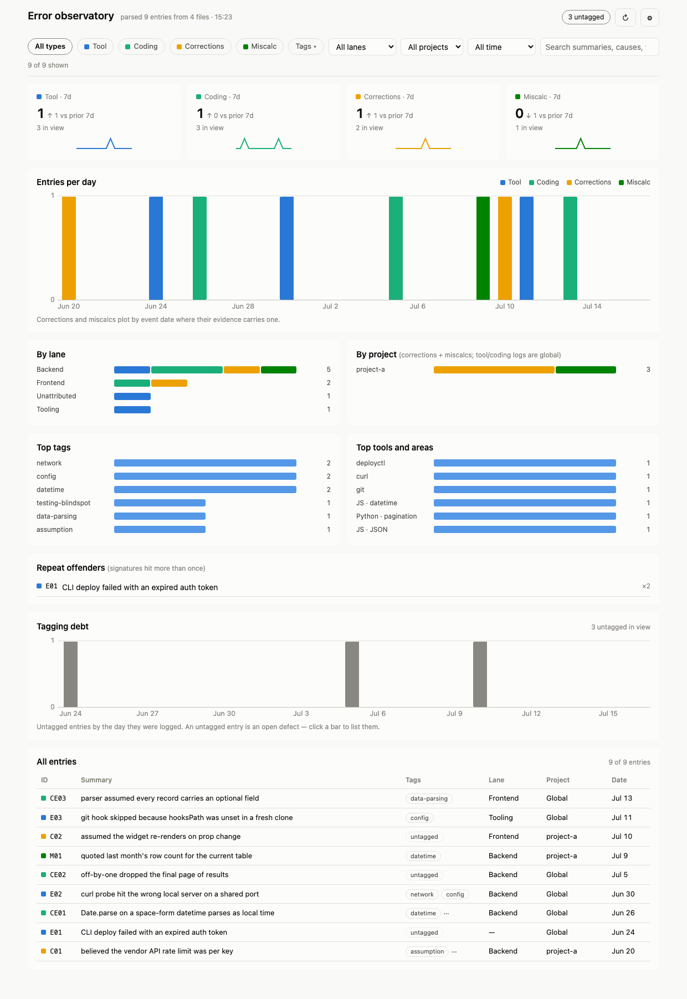
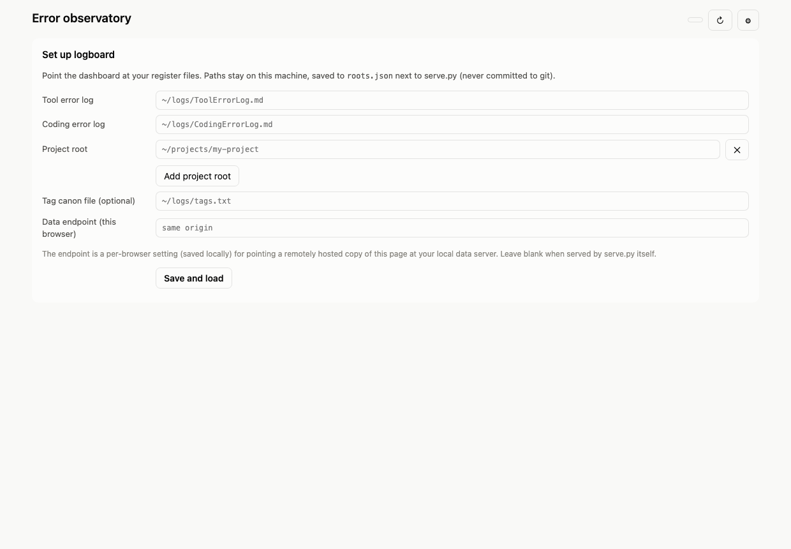
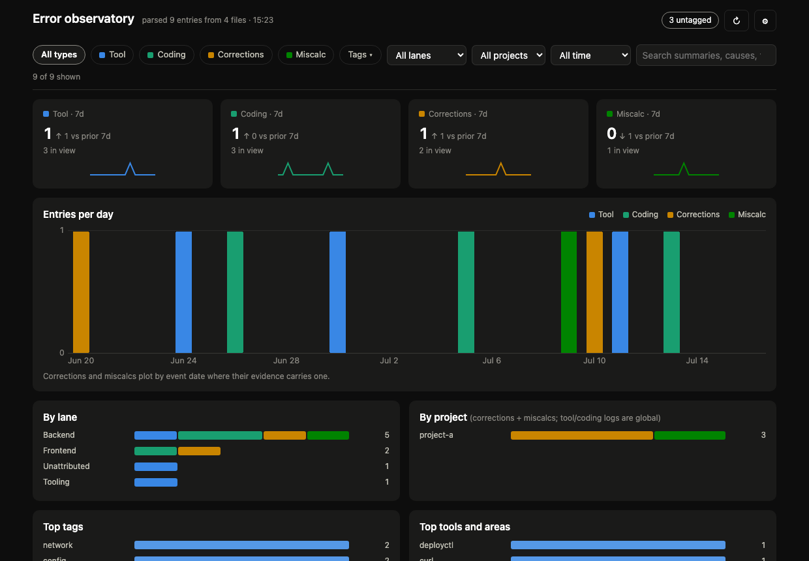

# logboard

A local dashboard over markdown issue registers — tool errors, coding errors, corrections, and miscalculations. One small Python server, one HTML page, zero dependencies. Your log files never leave your machine.

I log every resolved tool failure, coding defect, corrected assumption, and numeric slip into running markdown registers, so a mistake paid for once is never paid for twice. logboard turns those files into trends, hot-spots, and a searchable console.



## Quickstart

```
python3 serve.py
```

Open http://127.0.0.1:8799 and enter the paths to your register files in the setup screen:



That's it. The config is saved to `roots.json` next to serve.py — gitignored, so your paths and data are never tracked. Prefer a file? Copy `roots.example.json` to `roots.json` and edit. The port is `LOGBOARD_PORT` (default 8799), bound to 127.0.0.1 only.

Dark mode follows your system:



## What it shows

- Recency-first counts per register: last 7 days, delta vs the prior 7, sparkline
- Entries per day (auto-buckets to weeks on long ranges), stacked by register; picking a tag switches to an emphasis view
- Lane and project breakdowns
- Hot-spots: top tags, top tools and areas, and repeat offenders (signatures with more than one occurrence)
- Tagging debt: an untagged entry is an open defect, tracked in its own chart until it decays to zero
- A searchable, filterable table of every entry with full drill-down — deep-linkable by id (`#E13`) or tag (`#tag=network`)

Everything re-parses on every request, so the page is always current — edit a register, refresh the page.

## The register format

Each register is a plain markdown file. Entries live under a `## Details` heading; each entry is a heading plus labeled bullet lines (shown indented here; don't indent yours):

```
 ### E01 — one-line summary of the failure signature
 - **Lane:** who hit it
 - **Tool:** what broke
 - **Root cause:** why it really happened
 - **Resolution:** the reusable fix
 - **Tags:** network, config
 - **Occurrences:** 2026-06-24 10:02 EDT; 2026-07-08 09:15 EDT
```

Four register types, one grammar:

| Register | IDs | Scope | Category field | Fix field | Date field |
|---|---|---|---|---|---|
| Tool errors | E | global | Tool | Resolution | Occurrences |
| Coding errors | CE | global | Area | Fix | Occurrences |
| Corrections | C | per project (`corrections.md`) | Trigger | Correction | Date |
| Miscalculations | M | per project (`miscalculations.md`) | Wrong / Correct | Correct | Date |

Semantics worth knowing:

- A recurrence is not a new entry — append a `; `-separated segment to the existing entry's Occurrences line. The segment count is the occurrence count.
- Corrections and miscalculations carry the date they were logged (`Date`) and, optionally, the date the event actually happened — a trailing `| YYYY-MM-DD` at the end of the Evidence line. Charts prefer the event date.
- `Tags` is optional. Entries without it show up as tagging debt, not errors.
- An `## Index` table at the top of each file is treated as a derived view; only the Details blocks are parsed.
- Entries end at an HTML append-marker comment (see the example configs) or end of file.

## Tags

`tags.txt` is the controlled vocabulary: one tag per line, three tab-separated columns — name, which registers it applies to (comma list of E,CE,C,M), definition. Comment lines start with `#`. See `tags.example.txt`. Point the setup screen's tag-canon field at yours; tags in entries that aren't in the canon are flagged on the dashboard.

## Checks and audit

- `python3 serve.py --check` — parser self-checks: per-file parsed count must equal the heading count and the Index row count, plus payload sanity. Drop a `golden.local.json` next to serve.py (gitignored) to pin absolute counts and per-entry expectations.
- `python3 serve.py --audit` — strict tagging audit: exits nonzero listing every untagged entry, every off-canon tag, and canon syntax problems. Schedule it daily (cron, or launchd on macOS) and append to a log:

```
0 18 * * * cd /path/to/logboard && python3 serve.py --audit >> audit.log 2>&1
```

## Hosting the page elsewhere (optional)

The frontend is one static file. Host `index.html` anywhere, open its settings panel and point the data-endpoint field at your local server, and add the page's origin to `allowed_origins` in `roots.json`. serve.py answers CORS and private-network preflights only for origins you list (default: none). The data itself still never leaves your machine.

## Privacy by construction

- The server binds 127.0.0.1 and writes exactly one file, ever: its own `roots.json`. Registers are never opened for writing.
- This repo ships pre-commit and pre-push guards that refuse any path outside the tracked allowlist and any content that looks like a home-directory path or a real register entry. Enable them per clone: `git config core.hooksPath .githooks`
- The screenshots above are synthetic demo data.

MIT license.
